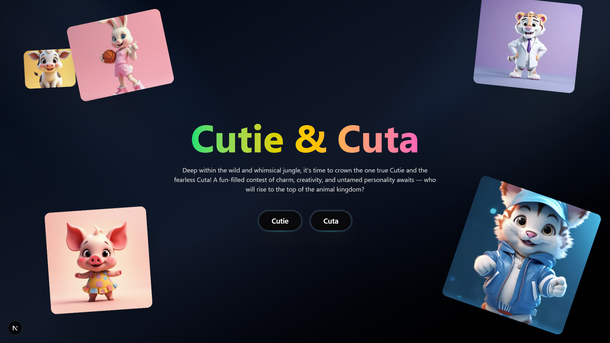
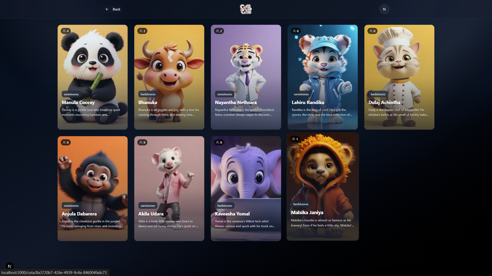

# Sosamala Voting

A self-hostable, open source, secure voting system for small public beauty contests and similar events. Designed for easy deployment, privacy, and fairness, with per-category leaderboards, a user-friendly admin dashboard, and real-time updates.

[**Live Demo →**](https://vote-sosamala.vercel.app/)

## Screenshots

   
  <em>Home page and real-time leaderboard view</em>

   
  <em>Voting page and contestant profile</em>

---

## Features

- One vote per email per category (privacy: voter email hashed)
- Google login (OAuth, no passwords)
- Public contestant pages (shareable links)
- Admin dashboard for easy management
- Supabase DB and Storage (public images, no cost surprises)
- Rate limiting and bot detection (Arcjet)
- All admin and vote security checked on the server

---

## Tech Stack

- **Frontend:** Next.js App Router, Tailwind CSS
- **Backend:** Next.js API routes (Edge/serverless-ready)
- **Auth:** Supabase Auth (Google OAuth2)
- **Database:** Supabase PostgreSQL (RLS enabled)
- **Storage:** Supabase Storage CDN
- **Security:** Arcjet (API security, rate limiting, bot detection), Supabase RLS

---

## Security Model

- Voter emails **never stored as plain text** (SHA256 + salt)
- One vote per hashed user per category (enforced by DB unique constraint)
- All admin access limited by one configured email (in `.env`)
- RLS for all sensitive DB tables and storage
- API routes use Arcjet for rate limits and bot detection
- No persistent login needed after voting (logout is optional)

---

## Self-Hosting & Deployment

**You need:** [Supabase](https://supabase.com/) (free tier is enough), [Vercel](https://vercel.com/) or any Next.js host.

1. **Create your Supabase project**
2. Run [`schema.sql`](./schema.sql) and [`rls.sql`](./rls.sql) in the Supabase SQL editor
3. Set up Supabase Storage bucket (for contestant images)
4. Clone this repo and configure your `.env` (see `.env.example`)
5. Deploy to Vercel (or run locally with `npm run dev`)

For detailed instructions, see [docs/SETUP.md](docs/SETUP.md) (coming soon!)

---

## Customization

- **Categories:** Add/remove categories in the database or admin dashboard
- **Logo/branding:** Replace `/public/logo/logo.png`
- **Admin email:** Edit the email in `rls.sql` and your environment variables
- **Styling:** Tweak Tailwind styles in `/components`

---

## License

MIT

---

## Author

Made by [NayanthaNethsara](https://github.com/NayanthaNethsara)

---

## Credits

- Built with Next.js, Supabase, Arcjet, and Tailwind CSS
- Open source, feedback welcome!
