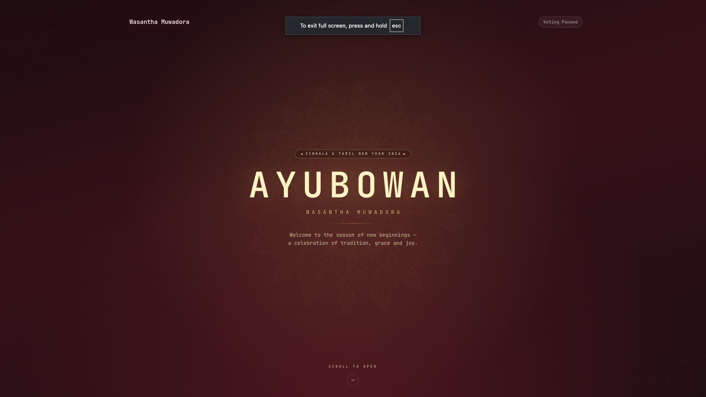
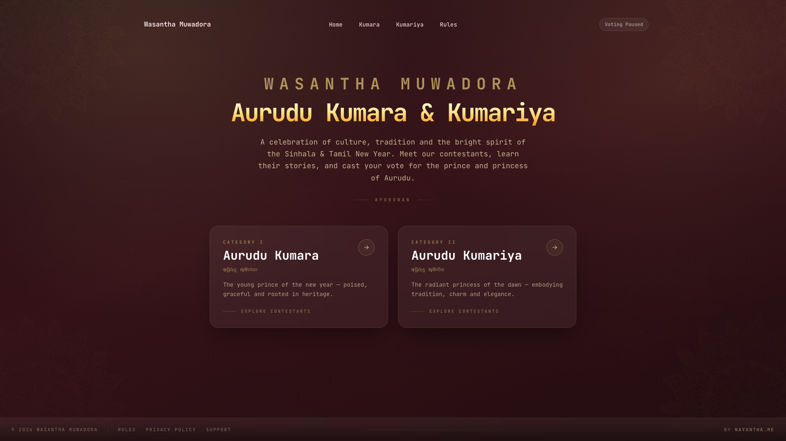
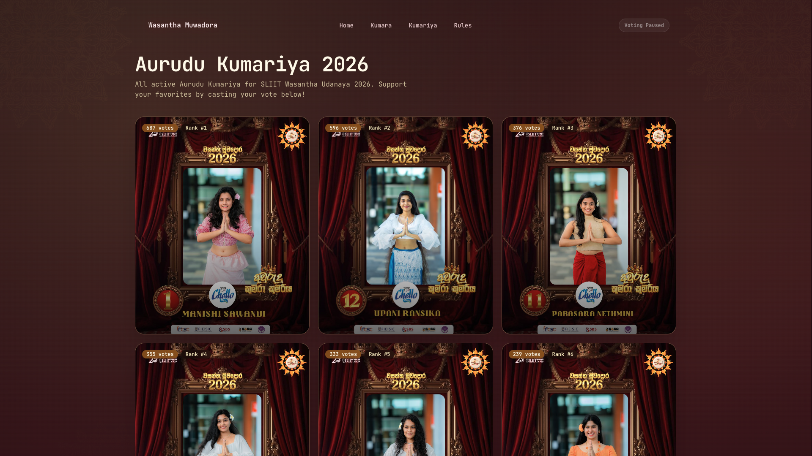
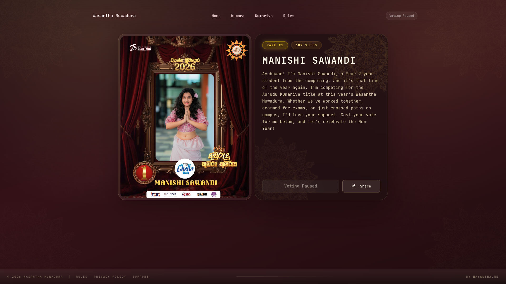
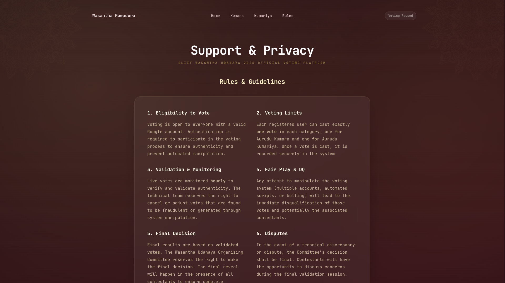

# Sosamala Voting

A self-hostable, open-source, secure voting platform for small public events.

This release is tuned for Aurudu-style events with category-based voting, Google auth, public contestant pages, and a simple admin dashboard.

[**Live Demo →**](https://wasantha-muwadora-2026.vercel.app/)

## Screenshots

<div align="center">
  <br>
</div>

<div align="center">
  <br>
</div>

<div align="center">
  <br>
</div>

<div align="center">
  <br>
</div>

<div align="center">
  <br>
</div>

---

## Core Features

- One vote per user per category
- Google OAuth login via Supabase Auth
- Public contestant pages with share links and OpenGraph previews
- Admin dashboard for contestant management
- Supabase PostgreSQL and Storage
- Arcjet rate limiting and abuse protection
- Secure vote flow through Supabase RPC and server actions

---

## Tech Stack

- **Frontend:** Next.js App Router, Tailwind CSS
- **Backend:** Next.js API routes (Edge/serverless-ready)
- **Auth:** Supabase Auth (Google OAuth2)
- **Database:** Supabase PostgreSQL (RLS enabled)
- **Storage:** Supabase Storage CDN
- **Security:** Arcjet (API security, rate limiting, bot detection), Supabase RLS

---

## Quick Setup

```bash
pnpm install
pnpm dev
npx supabase db push
```

Detailed setup: [docs/SETUP.md](docs/SETUP.md)

---

## Security Model

- Voter emails **never stored as plain text** (SHA256 + salt)
- One vote per hashed user per category (enforced by DB unique constraint)
- All admin access limited by one configured email (in `.env`)
- RLS for all sensitive DB tables and storage
- API routes use Arcjet for rate limits and bot detection
- No direct vote inserts from clients

---

## Documentation

- [docs/SETUP.md](docs/SETUP.md)
- [docs/ARCHITECTURE.md](docs/ARCHITECTURE.md)
- [docs/CUSTOMIZATION.md](docs/CUSTOMIZATION.md)
- [docs/CONTRIBUTING.md](docs/CONTRIBUTING.md)
- [RELEASE_NOTES.md](RELEASE_NOTES.md)

---

## License

MIT

---

## Author

Made by [NayanthaNethsara](https://github.com/NayanthaNethsara)

---

## Credits

- Built with Next.js, Supabase, Arcjet, and Tailwind CSS
- Open source, feedback welcome!
