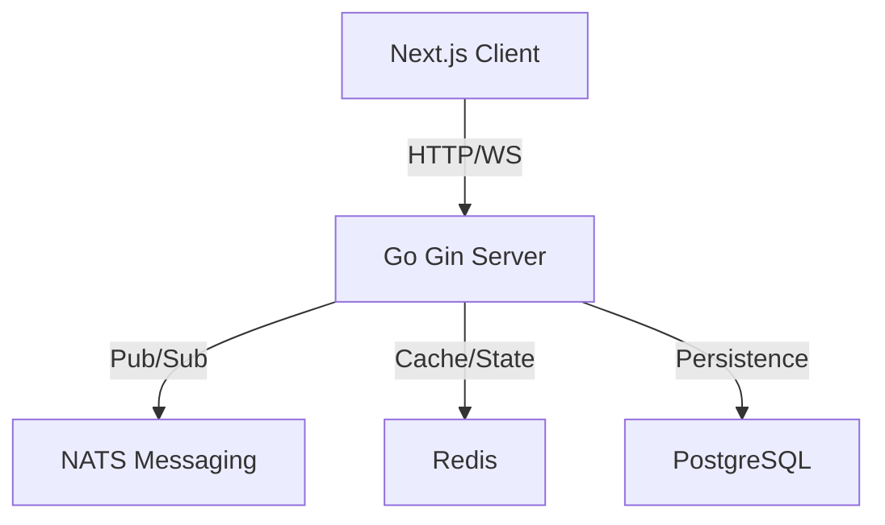

# Sosamala Voting

A self-hostable, open source, secure voting system for small public beauty contests and similar events. Designed for easy deployment, privacy, and fairness.

## Architecture


```mermaid
graph TD
    Client[Next.js Client] -->|HTTP/WS| Server[Go Gin Server]
    Server -->|Pub/Sub| NATS[NATS Messaging]
    Server -->|Cache/State| Redis[Redis]
    Server -->|Persistence| Postgres[PostgreSQL]
```

## Quick Start

You must have **Docker** and **Make** installed.

### 🐳 Full Stack (Docker)
The easiest way to get everything running in parallel is using the root `Makefile`:

```bash
make dev
```
- Frontend: `http://localhost:3000`
- Backend API: `http://localhost:8080`

### 🛠️ Manual Development
If you prefer running services outside of Docker for development:

**Backend (Go)**
```bash
make server-run
```

**Frontend (Next.js)**
```bash
make client-install
cd client && pnpm dev
```

---

## Makefile Automation
The central `Makefile` provides several commands for developers:

- `make fmt`: Format both client and server code
- `make lint`: Run all checkers and vets
- `make test`: Run project test suites
- `make build`: Build the backend binary

The application will be available at:

- Frontend: `http://localhost:3000`
- Backend API: `http://localhost:8080`

## Repository Structure

- `/client`: Next.js frontend (pnpm)
- `/server`: Go Gin backend (Go 1.25)
- `docker-compose.yml`: Infrastructure orchestration
- `Makefile`: Common development tasks

## Documentation

- [Frontend Documentation](client/README.md)
- [Backend Documentation](server/README.md)
- [Contributing Guide](CONTRIBUTING.md)

## License

[MIT](LICENSE)
