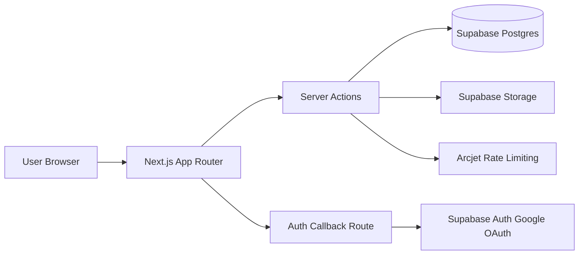
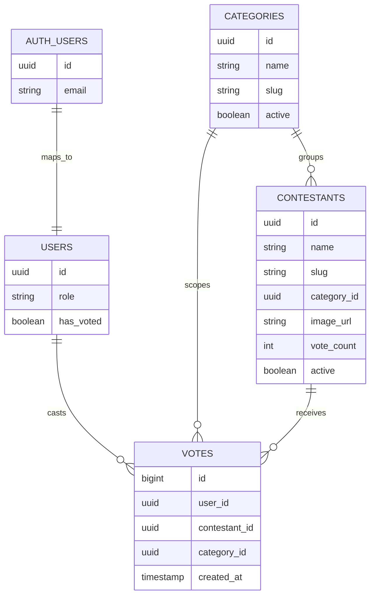
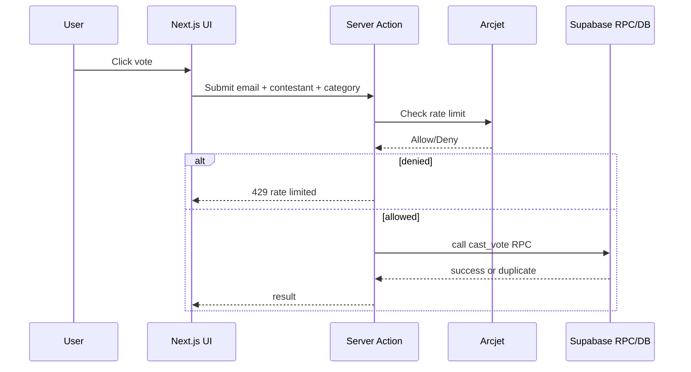

# Architecture

This document explains the runtime flow, data model, and security boundaries.

## System Overview

## Data Model

## Authentication and Authorization

- Authentication: Google OAuth via Supabase Auth.
- Session handling: Supabase cookies managed by server-side client.
- Authorization: role-based checks plus Row-Level Security (RLS).
- Admin access: restricted by role and server-side verification.

## Voting Flow

## Security Model

- One vote per user per category enforced with DB unique constraint.
- Direct vote table inserts are blocked; voting uses secure RPC.
- RLS is enabled for sensitive tables.
- Email privacy uses salted hashing.
- Arcjet protects voting endpoints from abuse.

## Storage

- Contestant images are stored in Supabase Storage bucket.
- Bucket is public for display assets.
- Upload and update paths are controlled by admin actions.

## Scalability Notes

- Leaderboards use cached `vote_count` for fast reads.
- Add indexes by category and vote count for larger events.
- Free tier is sufficient for small events; scale via Supabase/Vercel plans.
